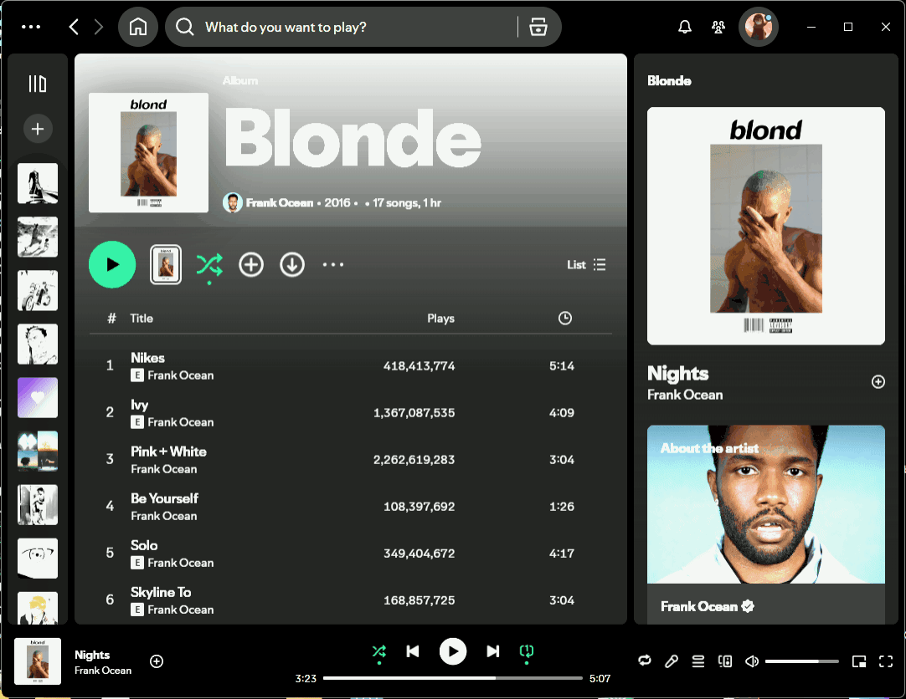

<p align="center">
  
</p>

<p align="center"><strong>Loop any part of a Spotify track.</strong></p>

SpotLoop is a lightweight [Spicetify](https://spicetify.app/) extension that adds A-B repeat controls to Spotify Desktop. Mark the beginning and end of a verse, chorus, solo, or any other moment, then replay that exact section without modifying the audio file.

<p align="center">
  
</p>

## Features

- Set loop point A and point B at the current playback position
- Drag both markers to fine-tune a section in 250 ms steps
- Start, pause, clear, and resume the current loop
- Instantly loop the previous 15 seconds
- Save named sections separately for every track
- Replay or delete saved sections from a Spotify-native popup
- Playbar button with an active-loop state
- Global keyboard shortcuts
- Local-only storage with no Spotify API credentials
- Automatic loop cancellation when the track changes

## Shortcuts

| Action | Windows / Linux |
| --- | --- |
| Set loop start A | `Ctrl + Shift + [` |
| Set loop end B | `Ctrl + Shift + ]` |
| Toggle current loop | `Ctrl + Shift + L` |

Click the SpotLoop button in Spotify's player bar to open the full controls. Right-click the button to quickly toggle the current loop.

## Install on Windows

1. Install the regular desktop version of Spotify from Spotify's website when possible. The Microsoft Store build is only partly supported by Spicetify.
2. Install [Spicetify CLI](https://spicetify.app/docs/getting-started/). One option is:

   ```powershell
   winget install --id Spicetify.Spicetify -e
   ```

3. Close and reopen PowerShell, then confirm the command works:

   ```powershell
   spicetify --version
   ```

4. [Download `spotloop.js`](spotloop.js) and copy it to:

   ```text
   %appdata%\spicetify\Extensions\spotloop.js
   ```

5. Close Spotify completely, then run:

   ```powershell
   spicetify config extensions spotloop.js
   spicetify backup apply
   ```

6. Open Spotify and look for the repeat-style SpotLoop button in the player bar.

The `spicetify config extensions` command appends SpotLoop to your existing extensions rather than replacing them.

### Microsoft Store Spotify

The Store build can work, but it must be launched through Spicetify after applying SpotLoop:

```powershell
spicetify auto
```

Keep that terminal open while Spotify is running. Do not launch the modified Store build from Spotify's original Start menu tile.

If PowerShell cannot find `spicetify` even though Winget reports it installed, locate the executable and use its full path:

```powershell
$spicetifyExe = Get-ChildItem `
  "$env:LOCALAPPDATA\spicetify", `
  "$env:LOCALAPPDATA\Microsoft\WinGet\Packages" `
  -Filter "spicetify.exe" -Recurse -ErrorAction SilentlyContinue |
  Select-Object -First 1

& $spicetifyExe.FullName config extensions spotloop.js
& $spicetifyExe.FullName backup apply
& $spicetifyExe.FullName auto
```

### Updating SpotLoop

Replace the installed `spotloop.js` with the latest version, close Spotify, then run:

```powershell
spicetify apply
```

## Install on Linux or macOS

Copy `spotloop.js` to `~/.config/spicetify/Extensions/`, then run:

```bash
spicetify config extensions spotloop.js
spicetify apply
```

## How to use it

1. Start playing a track.
2. Press **Set A** at the beginning of the part you want.
3. Press **Set B** at the end.
4. Select **Start loop**.
5. Optionally give the section a name and save it for that track.

The minimum loop length is one second. SpotLoop schedules the selected boundary and seeks back to A whenever playback reaches B, with player progress checks as a secondary safeguard.

## Development

SpotLoop intentionally ships as a single JavaScript file, so contributors can test it without a build step.

```bash
npm test
npm run check
```

To test inside Spotify, copy the edited `spotloop.js` into the Spicetify Extensions folder and run `spicetify apply` again. Spotify DevTools can be opened with `Ctrl + Shift + I` on Windows/Linux.

## Current limitations

- Spicetify and Spotify Desktop are required. The extension does not run in the web player or mobile apps.
- Seeking behavior depends on the current Spotify client and whether the playing item is seekable.
- Global shortcut conflicts are possible when another extension uses the same key combination.
- Spotify or Spicetify updates can require reapplying or updating the extension.

## Privacy

SpotLoop does not send track data anywhere. Saved section names and timestamps remain in Spotify Desktop's local storage.

## Disclaimer

SpotLoop is an unofficial Spicetify extension and is not affiliated with or endorsed by Spotify. Spotify is a trademark of Spotify AB.

## License

Released under the [MIT License](LICENSE).
